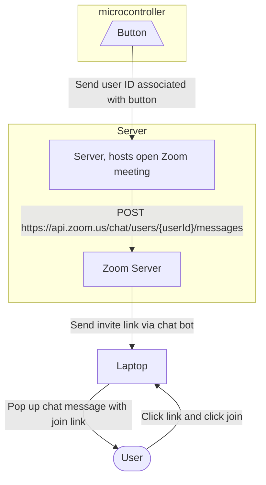

# VirtualCoffeeKitchen
Digital twin for a virtual meeting room to interact with co-workers.
The product is an implementation of a device that displays the current number of participants from a web API on an OLED screen. The device can connect to a Wi-Fi network or act as an access point. The device can also be configured to send a chat message to a Zoom meeting when the button is pressed. The device can be powered by a battery or a USB cable.

# Technology used

# Libraries
The code uses the following libraries:

- WiFi.h: A library that allows the device to connect to a Wi-Fi network.
- HTTPClient.h: A library that simplifies making HTTP requests.
- WebServer.h: A library for implementing a web server.
- EEPROM.h: A library for reading and writing to the device's EEPROM memory.
- Heltec.h: A library that provides support for the Heltec WiFi Kit 32 development board and its peripherals.
- Wire.h: A library that provides support for I2C communication.
- iostream: A standard C++ library for input/output operations.
- string: A standard C++ library for string manipulation.

# Variables

- PrevParticipants: An integer that stores the number of participants in the last check.
- statusCode: An integer that stores the HTTP status code of the last configuration request.
- pressedTime: An unsigned long that stores the time when the button was pressed.
- totalPressTime: An unsigned long that stores the total time the button has been pressed.
- buttonPressed: An integer that indicates whether the button is pressed or not.
- content: A string that stores the content of the last HTTP response.
- esid: A string that stores the SSID of the Wi-Fi network.
- epass: A string that stores the password of the Wi-Fi network.
- eemail: A string that stores the email of the user.
- ip: An IPAddress that stores the IP address of the device.
- ipStr: A string that stores the IP address of the device as a string.
- bootCount: An integer that stores the number of times the device has been booted.

# Functions

- testWifi(): A function that tests the Wi-Fi connection by pinging Google's DNS server. Returns true if successful, false otherwise.
- launchWeb(): A function that redirects the user to the device's configuration page.
- setupAP(): A function that sets up the device as an access point.
print_wakeup_reason(): A function that prints the reason the device was woken up from sleep.
- isr(): An interrupt service routine that is triggered when the button is pressed.
getCurrentParticipants(): A function that sends an HTTP GET request to a web API and returns the current number of participants.
- displayParticipantsCount(int count): A function that displays the number of participants on the OLED screen.
- flash(): A function that flashes the OLED screen to indicate that the number of participants has increased.
displayBatteryAndWifi(): A function that displays the battery level and the Wi-Fi status on the OLED screen.
Setup Function
- The Serial.begin() function is called to initialize the serial monitor with a baud rate of 115200.
- The Heltec.begin() function is called to initialize the OLED screen, the LoRa radio (which is disabled in this case), and - the serial port. The arguments are true, false, and true, respectively.
- The WiFi.disconnect() function is called to disconnect from any previously connected Wi-Fi network.
- The EEPROM.begin() function is called to initialize the EEPROM memory.
- The attachInterrupt() function is called to attach an interrupt service routine to the button pin.

# Loop Function

- The print_wakeup_reason() function is called to print the reason for the device's wakeup.
- The displayBatteryAndWifi() - A function that displays the battery level, WiFi connectivity status and the current number of participants on the OLED screen. It calls the testWifi() and getCurrentParticipants() functions to check for WiFi connectivity and to fetch the number of participants respectively. If WiFi connectivity is established and the number of participants has increased since the previous check, the function calls the flash() function to flash the OLED screen.
- setup() - The setup function initializes the serial monitor, OLED screen and EEPROM. It sets up an interrupt on pin 0 to detect changes in the state of a button. It also calls testWifi() to check for WiFi connectivity and calls setupAP() if WiFi connectivity is not established.
- loop() - The main loop function that continuously checks for changes in the state of the button. If the button is pressed for more than 5 seconds, it calls the launchWeb() function. Otherwise, it calls the displayBatteryAndWifi() function to display the battery level, WiFi connectivity status and the current number of participants on the OLED screen.

# Global variables

- PrevParticipants - An integer that stores the previous number of participants.
- statusCode - An integer that stores the status code of the configuration result.
- pressedTime - An unsigned long that stores the time at which the button was pressed.
- totalPressTime - An unsigned long that stores the total time the button was pressed.
- buttonPressed - An integer that stores the state of the button.
- content - A string that stores the content of the HTTP response.
- esid - A string that stores the WiFi SSID.
- epass - A string that stores the WiFi password.
- eemail - A string that stores the email address.
- ip - An IP address object that stores the IP address of the device.
- ipStr - A string that stores the IP address of the device as a string.
- bootCount - An integer that stores the number of times the device has booted.

# Helper functions
 
testWifi() - A function that tests WiFi connectivity by attempting to connect to a default WiFi network. If the connection is successful, the function returns true. If the connection is unsuccessful, the function returns false.
launchWeb() - A function that launches a web server on the device and waits for configuration data to be sent to it via HTTP. If the configuration data is received, the function saves the data to EEPROM and resets the device.
setupAP() - A function that sets up the device as a WiFi access point and launches a web server on it to allow for configuration. If the configuration is successful, the function saves the data to EEPROM and resets the device.
print_wakeup_reason() - A function that prints the reason for which the device has been awakened from sleep.
isr() - An interrupt service routine that is called when there is a change in the state of the button. If the button is pressed, it calls the doFalling() function. If the button is released, it calls the doRising() function.
getCurrentParticipants() - A function that fetches the current number of participants by making an HTTP GET request to a remote server. If the request is successful, the function returns the number of participants as an integer. If the request is unsuccessful, the function returns -1.
displayParticipantsCount(int count) - A function that displays the current number of participants on the OLED screen.
flash() - A function that flashes the OLED screen to indicate an increase in the number of participants.

# Event functions

doFalling() - A function that is called when the button is pressed. This function increments the count of participants, displays the updated count on the OLED screen using the displayParticipantsCount() function, and flashes the OLED screen using the flash() function.

doRising() - A function that is called when the button is released. This function sends the updated count of participants to a remote server via an HTTP POST request. If the request is successful, the function prints a success message to the serial monitor. If the request is unsuccessful, the function prints an error message to the serial monitor.

# Main function

setup() - The main function of the program. This function initializes the serial monitor, OLED screen, and button. It then checks if the device has been awakened from sleep and prints the wakeup reason using the print_wakeup_reason() function. If the device has been awakened due to a button press, it calls the doFalling() function. If the device has been awakened due to a timer interrupt, it calls the doRising() function. If the device has not been awakened, it checks for WiFi connectivity using the testWifi() function. If WiFi is available, it fetches the current participant count using the getCurrentParticipants() function and displays it on the OLED screen. If WiFi is not available, it sets up the device as a WiFi access point using the setupAP() function and launches a web server to allow for configuration. If the configuration data is received, it saves the data to EEPROM and resets the device.

# How to setup the Work Environment
1. Download and install the Arduino IDE from https://www.arduino.cc/en/Main/Software
2. Download and install the ESP32 board support packages

# How to run the code

# How to use the code

# How to contribute

# How to report bugs

# 

# Conclusion

The code provided in this documentation is an example of a basic IoT project that uses an ESP32 microcontroller to count and display the number of participants at an event. The code demonstrates how to use the ESP32 to connect to WiFi, interact with web servers, and interface with peripherals such as OLED screens and buttons. This code can be used as a starting point for more complex IoT projects that require similar functionality.