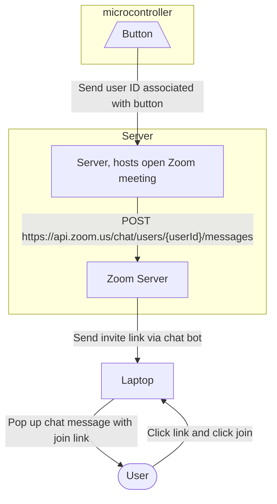

# VirtualCoffeeKitchen Server

Digital twin for a virtual meeting room to interact with co-workers. It is made up by 
1. a device that displays the number of participants currently in said room. It can also send a link to join the meeting in this room. The link gets sent to the user the device is configured for via button click. 
2. a server that communicates with the Zoom APIs needed for these actions and can be reached by the device via API calls. 



This is the code for the server that provides an API for the device to call. 

The first API call is ```$ curl -X POST -d email=<chat message recipient> http://<your server IP and port>/join-meetings```. 
It sends the following Zoom chat message from the tech user (configurable in the .env file) to the Zoom user whose email address is passed as a payload in the curl: "This is your coffee kitchen join URL: https://us06web.zoom.us/j/5024947364?pwd=OUw2ZnE3VFFXcjVZKzJkdHJidXF2Zz09". The URL is hard-coded and allows the user to enter a permanent Zoom room hosted by the tech user. It needs to be changed to a new permanent Zoom room URL in case the tech user changes.  

The second API call is ```$ curl <your server id>/participant-count```. It returns the number of participants currently in the Zoom room mentioned above. 

# Deployment: 

With Docker:

To build the Docker image, run ```$ docker build --tag kitchen-docker .``` in the /coffee-kitche-server directory. You will have to rebuild it every time you change the code. 
To start the Docker container, run ```$ docker run --net=host -d  kitchen-docker```. Your app will now run on localhost:80 in your browser. 

Without Docker:
To run locally (without using the Docker), run ```$ python3 -m venv .venv
$ source .venv/bin/activate``` to activate the environment you are working in. 
Next, run ```$ pip3 install -r requirements.txt``` to install Flask and its dependencies.
Then, run ```$ python3 kitchen.py``` and open http://localhost:80 in your browser. 

# Changing the tech user

If you are using this code with a different tech user (who must at least have a business account), you need to build a server-to-server oauth app on amazon marketplace to get the necessary credentials: https://marketplace.zoom.us/develop/create

The admin has to give the tech user the following rights: 
- chat_message:write:admin
- dashboard_meetings:read:admin
- meeting:write:admin
- user:read:admin

The tech user then has to add the above rights as scopes to the marketplace app and copy the credentials into the .env file. 
The tech user needs to create a permanent Zoom room (recurring meeting without set time and "enable participants to enter anytime" set to true) and change the message sent to the user: 

"This is your coffee kitchen join URL: \<the join url for the permanent Zoom room\>"
  
 The tech user has to add the potential meeting participants to "Contacts" via Zoom App and they have to approve the contact request. 

# How to contribute
  
1. Fork the repository.
2. Make the changes in your forked repository.
3. Create a pull request.

# How to report bugs
  
1. Create an issue in the repository.

